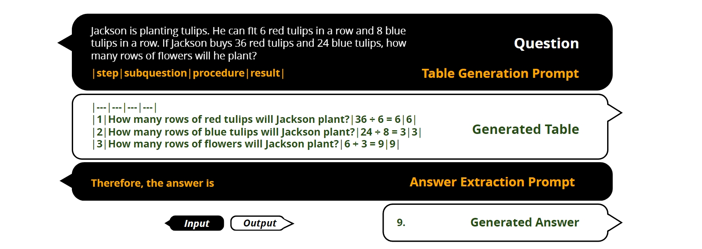

# Tab-CoT: Zero-shot Tabular Chain of Thought

This is the official implementation of `Tab-CoT: Zero-shot Tabular Chain of Thought` (Accepted at Findings of ACL 2023).

The paper is available at https://arxiv.org/abs/2305.17812.

<div align="center">

</div>

## Demo

We have setup a demo on HuggingFace. Feel free to play around with it. 

https://huggingface.co/spaces/Xalphinions/tab-cot

You can also setup your own gradio demo locally:

```
python app_gradio.py
```

## Installation

Setup the environment from requirements.txt: 
```
pip install -r requirements.txt
```

## Get Started

To use our code, you must have your own OpenAI API from: https://beta.openai.com/account/api-keys, and set it as environment variable "OPENAI_API_KEY". (You can also change util.py:61 to directly edit the API)

```
export OPENAI_API_KEY=(YOUR OPENAI API KEY)
```

Noted that CodeX API is not open to public usage as of May, 2023. However, our code can still work with the recent GPT-3.5;

### Zero-shot
```
python main.py --model=gpt3-xl --dataset=singleeq --limit_dataset_size 0 --model=chatgpt --method=zero_shot_cot
```

### Zero-shot with self-consistency:
```
python main.py --model=gpt3-xl --dataset=singleeq --limit_dataset_size 0 --model=chatgpt --method=zero_shot_cot --self_consistency
```

### Few-shot:
```
python main.py --model=gpt3-xl --dataset=singleeq --limit_dataset_size 0 --model=chatgpt --method=few_shot_cot
```

You can replace "singleeq" to any other datasets we included: "aqua", "gsm8k", "commonsensqa", "addsub", "multiarith",  "strategyqa", "svamp", "singleeq", "coin_flip", "last_letters"

## Citation

To cite our paper, please include the following bibtex:

```
@misc{jin2023tabcot,
      title={Tab-CoT: Zero-shot Tabular Chain of Thought}, 
      author={Ziqi Jin and Wei Lu},
      year={2023},
      booktitle = {Findings of ACL},
      url={[cs.CL](https://arxiv.org/abs/2305.17812)}
}
```
